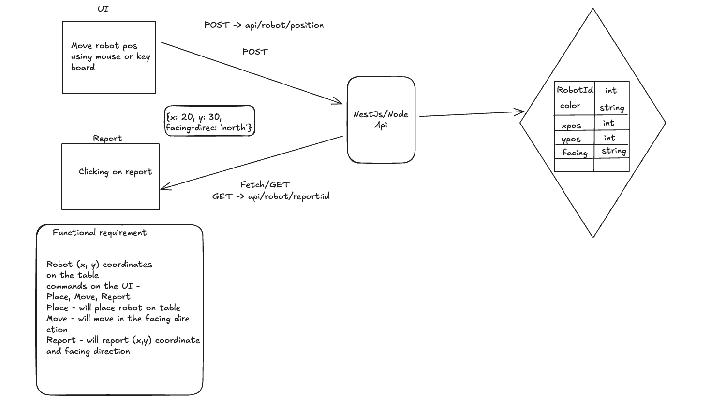

# Toy Robot Simulator



A full-stack web application that simulates a robot moving on a 5×5 grid. Built with Angular frontend and NestJS backend, featuring real-time state management, persistent database storage, and boundary-protected movement.

## Overview

The Toy Robot Simulator allows users to place a robot on a grid, move it in cardinal directions, rotate it, and track its movements. The application provides instant visual feedback, enforces grid boundaries, and persists the robot's state to a SQLite database for restoration on page refresh.

## Key Features

✨ **Interactive Grid Interface**
- Click any cell on a 5×5 grid to place a robot
- Visual robot icon displays position and facing direction
- Real-time coordinate feedback with origin at bottom-left (0,0)

🎮 **Multiple Input Methods**
- Mouse: Click grid cells to place robot
- Keyboard: Arrow keys for movement and rotation
- Buttons: LEFT, MOVE, RIGHT, REPORT controls
- Intuitive command system matching classic robot simulator specs

🛡️ **Safety Features**
- Boundary protection prevents movement outside grid
- Client-side validation for immediate feedback
- Server-side validation for data integrity
- Clear error messages for invalid operations

💾 **State Persistence**
- Automatic database save after each action
- Page refresh restores last known robot position
- Movement history tracking for future replay features
- SQLite database for reliable local storage

🎨 **Modern UI**
- Clean dark theme with cyan accent colors
- Responsive layout with sidebar controls
- Real-time status messages
- Animated direction indicators

## Technology Stack

### Frontend
- **Angular 18+** - Standalone components, signals for state management
- **RxJS** - Observable-based HTTP communication
- **Angular CDK** - Drag-and-drop support
- **TypeScript** - Type-safe component development

### Backend
- **NestJS 10+** - Enterprise-grade Node.js framework
- **TypeORM** - Object-relational mapping for database operations
- **SQLite** - Lightweight persistent storage
- **@nestjs/config** - Environment-based configuration

## Project Structure

```
toyrobot/
├── backend/
│   └── src/app/
│       ├── robot/
│       │   ├── robot.entity.ts       # Database schemas
│       │   ├── robot.service.ts      # Business logic
│       │   ├── robot.controller.ts   # REST endpoints
│       │   └── robot.module.ts       # NestJS module
│       ├── app.module.ts             # Root module
│       └── main.ts                   # Server entry point
├── frontend/
│   └── src/app/
│       ├── services/
│       │   ├── robot-data.service.ts     # HTTP client
│       │   └── robot-command.service.ts  # Event bus
│       ├── pages/
│       │   ├── playground/               # Main grid component
│       │   ├── robot-icon/               # Robot visual
│       │   └── robot/                    # Control buttons
│       └── models/
│           └── robot.type.ts             # TypeScript interfaces
├── .env.example                      # Configuration template
├── .env                              # Configuration file
└── package.json                      # Dependencies
```

## Getting Started

### Prerequisites
- Node.js 18+ 
- npm or yarn

### Installation

1. **Clone the repository**
   ```bash
   git clone <repository-url>
   cd toyrobot
   ```

2. **Configure environment**
   ```bash
   cp .env.example .env
   ```

3. **Install dependencies**
   ```bash
   npm install
   ```

### Running the Application

**Terminal 1 - Backend Server**
```bash
npx nx serve backend
```
Backend runs on `http://localhost:3000/api`

**Terminal 2 - Frontend Application**
```bash
npx nx serve frontend
```
Frontend runs on `http://localhost:4200`

Open your browser to `http://localhost:4200`

## Usage

### Commands

**PLACE** - Click on any grid cell
- Positions robot at that cell facing north
- Saves position to database

**MOVE** - Press Up Arrow (↑) or click Move Button
- Moves robot one cell forward in facing direction
- Blocked by grid boundaries

**LEFT** - Press Left Arrow (←) or click Left Button
- Rotates robot 90° counter-clockwise
- NORTH → WEST → SOUTH → EAST → NORTH

**RIGHT** - Press Right Arrow (→) or click Right Button
- Rotates robot 90° clockwise
- NORTH → EAST → SOUTH → WEST → NORTH

**REPORT** - Press Space or click Report Button
- Displays robot's current X, Y coordinates and facing direction
- Format: "X: [x], Y: [y], F: [direction]"

## Coordinate System

```
(0,4)---(1,4)---(2,4)---(3,4)---(4,4)  [NORTH ↑]
  |       |       |       |       |
(0,3)---(1,3)---(2,3)---(3,3)---(4,3)
  |       |       |       |       |
(0,2)---(1,2)---(2,2)---(3,2)---(4,2)
  |       |       |       |       |
(0,1)---(1,1)---(2,1)---(3,1)---(4,1)
  |       |       |       |       |
(0,0)---(1,0)---(2,0)---(3,0)---(4,0)  [SOUTH ↓]
[WEST ←]                          [EAST →]
```

**Origin (0,0) is at the bottom-left corner**

## API Reference

### REST Endpoints

```
POST   /api/robot/position      Save robot position
GET    /api/robot/report        Get current robot state
GET    /api/robot/history       Get movement history
```

### Request/Response Examples

**Save Position**
```
POST /api/robot/position
{
  "x": 2,
  "y": 3,
  "facing": "NORTH"
}
```

**Get Report**
```
GET /api/robot/report
Response:
{
  "x": 2,
  "y": 3,
  "facing": "NORTH"
}
```

## Configuration

Edit `.env` to customize:
```
PORT=3000                          # Backend server port
NODE_ENV=development               # Environment mode
DATABASE_TYPE=sqlite               # Database system
DATABASE_NAME=toyrobot.db          # Database file
DATABASE_SYNCHRONIZE=true          # Auto-sync schema
FRONTEND_URL=http://localhost:4200 # CORS origin
API_URL=http://localhost:3000/api  # Backend API URL
```

## Database

### Tables

**robot** - Current robot state
- id (primary key)
- x (0-4)
- y (0-4)
- facing (NORTH|EAST|SOUTH|WEST)
- updatedAt (timestamp)

**robot_history** - Movement log
- id (primary key)
- robotId (foreign key)
- x, y, facing (position at action)
- action (type of command)
- createdAt (timestamp)

### Useful Commands

```bash
# View current robot position
sqlite3 toyrobot.db "SELECT * FROM robot;"

# View recent movements
sqlite3 toyrobot.db "SELECT * FROM robot_history ORDER BY created_at DESC LIMIT 10;"

# Reset database
rm toyrobot.db
```

## Development

### Building for Production

**Backend**
```bash
npx nx build backend
```

**Frontend**
```bash
npx nx build frontend
```

### Running Tests

```bash
# Backend tests
npx nx test backend

# Frontend tests
npx nx test frontend
```

## Architecture Notes

### Frontend
- **Signals**: State management using Angular signals for reactivity
- **Services**: Decoupled service layer with RxJS observables
- **Event Bus**: RobotCommandService for inter-component communication
- **No ViewChild**: Uses service-based communication instead

### Backend
- **Layered Architecture**: Controllers → Services → Repositories
- **Validation**: Boundary checks on both client and server
- **Configuration**: Environment-based config with @nestjs/config
- **Database**: TypeORM with automatic schema synchronization

## Future Enhancements

- [ ] Multiple robot support with independent tracking
- [ ] Obstacle/wall placement on grid
- [ ] Undo/redo functionality
- [ ] Movement replay from history
- [ ] Difficulty levels and time challenges
- [ ] User authentication and sessions
- [ ] REST API documentation (Swagger)
- [ ] PostgreSQL migration path for production
- [ ] WebSocket real-time updates
- [ ] Mobile-responsive design improvements

## Troubleshooting

| Issue | Solution |
|-------|----------|
| Backend not found (404) | Ensure backend is running on port 3000 |
| CORS errors | Check FRONTEND_URL in .env matches actual frontend URL |
| Database locked | Close other SQLite connections, restart backend |
| Robot position not persisting | Delete `toyrobot.db` and refresh page |
| Port already in use | Change PORT in .env or kill process on that port |

## License

This project is provided as-is for educational and demonstration purposes.

## Support

For issues or questions, please refer to the project documentation or create an issue in the repository.
